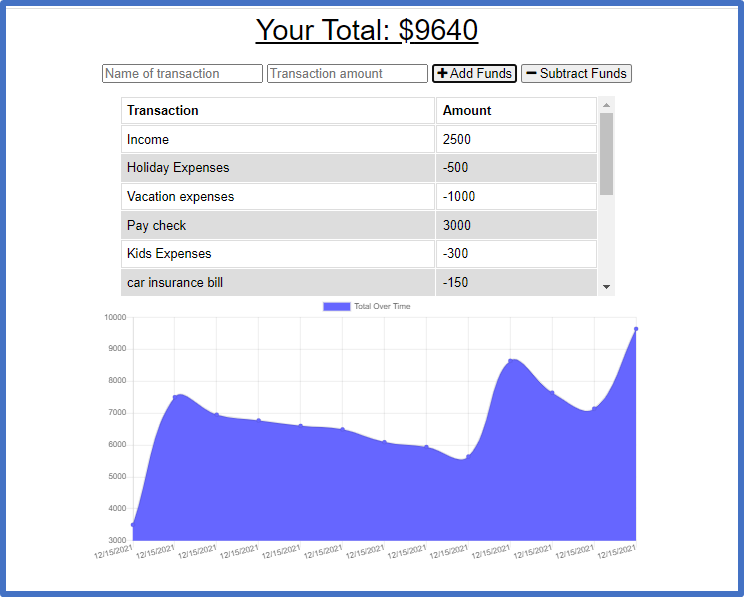

## Progressive Web Applications (PWA): Budget Tracker

### Description
A Mobile-First, Progressive Web Application (PWA) Budget Tracker that allows a user to track income and expenses online and offline

## Table of Contents
- [Description](#description)
- [User Story](#user-story)
- [Acceptance Criteria](#acceptance-criteria)
- [Installation](#installation)
- [Usage](#usage)
- [screenshot](#App-Screenshot)
- [Heroku-Link](#App-Deployed-to-Heroku)
- [App-Demo](#App-Demo)
- [Questions](#questions)

### User Story
AS AN avid traveler
I WANT to be able to track my withdrawals and deposits with or without a data/internet connection
SO THAT my account balance is accurate when I am traveling 

### Application Functionalities

- The ability to enter deposits offline.
- The ability to enter expenses offline.
- Offline entries should be added to the tracker when the application is brought back online
## Installation
`npm install`
  
## Usage
`npm start`
`npm run watch`

### App Screenshot

### Github Link
https://github.com/patelpr03/Budget-Tracker

###  Deployed to Heroku
https://p-budget-tracker.herokuapp.com/

